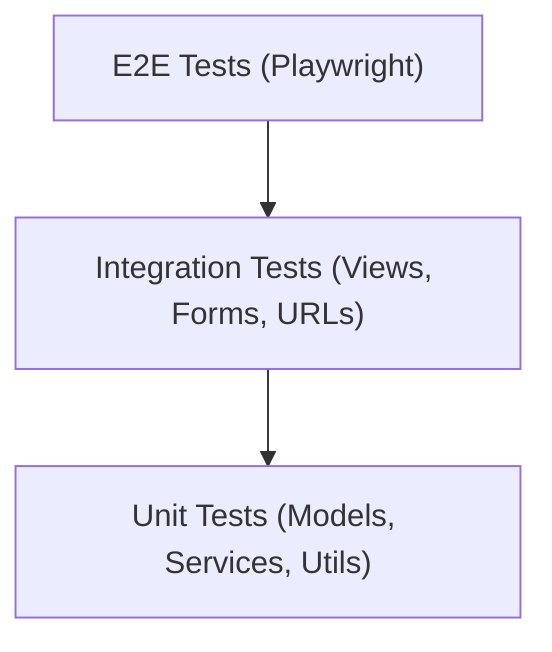

# Testing Strategy for PrimeTimePix

## The Testing Pyramid



- **Unit tests** (bottom, most tests) -- fast, test one function/method in isolation
- **Integration tests** (middle) -- test views, forms, database interactions together
- **E2E tests** (top, fewest tests) -- test the full browser flow like a real user

---

## 1. Test Environment Setup

### Configuration

Create a test settings file at `primetimepix/settings/test.py`:

```python
from .base import *

DEBUG = True
DATABASES = {
    'default': {
        'ENGINE': 'django.db.backends.sqlite3',
        'NAME': ':memory:',
    }
}
EMAIL_BACKEND = 'django.core.mail.backends.locmem.EmailBackend'
PASSWORD_HASHERS = ['django.contrib.auth.hashers.MD5PasswordHasher']
```

**Why this matters:**
- `:memory:` SQLite = tests run fast (no disk I/O, fresh DB every time)
- `locmem.EmailBackend` = emails get captured in memory (you can assert on them)
- `MD5PasswordHasher` = password hashing is faster (tests run quicker)

### pytest configuration

Create `pytest.ini` at the project root:

```ini
[pytest]
DJANGO_SETTINGS_MODULE = primetimepix.settings.test
python_files = tests.py test_*.py
python_classes = Test*
python_functions = test_*
addopts = -v --tb=short
```

### conftest.py (shared test fixtures)

Create `conftest.py` at the project root with reusable fixtures:

```python
import pytest
from django.contrib.auth import get_user_model
from apps.users.models import Profile
from apps.leagues.models import League, LeagueMembership
from apps.games.models import Game
from django.utils import timezone
from datetime import timedelta

User = get_user_model()

@pytest.fixture
def user(db):
    u = User.objects.create_user(username='testplayer', password='testpass123', email='test@test.com')
    Profile.objects.get_or_create(user=u, defaults={'team_name': 'TestTeam'})
    return u

@pytest.fixture
def league(db, user):
    league = League.objects.create(name='Test League', commissioner=user, sport='NFL', is_private=False, is_approved=True)
    LeagueMembership.objects.create(user=user, league=league)
    return league

@pytest.fixture
def future_game(db):
    return Game.objects.create(
        game_id='test_game_1', season=2026, week=1, game_type='regular',
        start_time=timezone.now() + timedelta(days=1),
        home_team='Kansas City Chiefs', away_team='Buffalo Bills', status='scheduled'
    )

@pytest.fixture
def finished_game(db):
    return Game.objects.create(
        game_id='test_game_2', season=2026, week=1, game_type='regular',
        start_time=timezone.now() - timedelta(days=1),
        home_team='Kansas City Chiefs', away_team='Buffalo Bills',
        home_score=27, away_score=24, status='final'
    )
```

---

## 2. Unit Tests (Models and Services)

These test individual methods in isolation. File: [apps/picks/tests.py](apps/picks/tests.py)

**What to test:**
- `Game.is_primetime` -- does it correctly identify primetime games?
- `Game.winner` -- does it return the right team?
- `Game.can_make_picks()` -- does it lock at kickoff?
- `Pick.calculate_result()` -- does it correctly mark picks right/wrong?
- `CPUPick.resolve()` -- does it resolve correctly?
- `PickService.save_user_picks()` -- does it save and validate?
- `PickService.calculate_leaderboard()` -- does it rank correctly?

**Example test:**
```python
import pytest
from apps.picks.models import Pick, CPUPick

@pytest.mark.django_db
class TestPickModel:
    def test_correct_pick(self, user, finished_game):
        pick = Pick.objects.create(user=user, game=finished_game, picked_team='Kansas City Chiefs')
        pick.calculate_result()
        assert pick.is_correct is True
        assert pick.points == 1

    def test_incorrect_pick(self, user, finished_game):
        pick = Pick.objects.create(user=user, game=finished_game, picked_team='Buffalo Bills')
        pick.calculate_result()
        assert pick.is_correct is False
        assert pick.points == 0

    def test_cannot_pick_started_game(self, user, finished_game):
        assert finished_game.can_make_picks() is False

    def test_can_pick_future_game(self, user, future_game):
        assert future_game.can_make_picks() is True
```

---

## 3. Integration Tests (Views, Forms, Full Request Cycle)

These test HTTP requests through Django's test client. File: [apps/users/tests.py](apps/users/tests.py)

**What to test:**
- Signup creates user + profile + logs in
- Login/logout work
- Dashboard loads for authenticated users
- Schedule page shows games
- Picks can be submitted via POST
- Standings page renders

**Example test:**
```python
import pytest
from django.test import Client
from django.urls import reverse

@pytest.mark.django_db
class TestSignupFlow:
    def test_signup_creates_user_and_redirects(self):
        client = Client()
        response = client.post(reverse('signup'), {
            'username': 'newuser',
            'email': 'new@test.com',
            'team_name': 'MyTeam',
            'password1': 'strongpass123!',
            'password2': 'strongpass123!',
        })
        assert response.status_code == 302  # Redirect to dashboard
        from django.contrib.auth import get_user_model
        assert get_user_model().objects.filter(username='newuser').exists()

    def test_dashboard_requires_login(self):
        client = Client()
        response = client.get(reverse('dashboard'))
        assert response.status_code == 302  # Redirects to login

@pytest.mark.django_db
class TestPicksFlow:
    def test_schedule_page_loads(self, user):
        client = Client()
        client.login(username='testplayer', password='testpass123')
        response = client.get(reverse('schedule'))
        assert response.status_code == 200

    def test_submit_pick(self, user, future_game, league):
        client = Client()
        client.login(username='testplayer', password='testpass123')
        response = client.post(reverse('schedule'), {
            f'pick_{future_game.id}': 'home',
            'league': league.id,
        })
        assert response.status_code == 302
        from apps.picks.models import Pick
        assert Pick.objects.filter(user=user, game=future_game).exists()
```

---

## 4. End-to-End Tests (Playwright)

These test the full browser experience. You already use Playwright, so this extends it for your app.

**Setup for local testing:**
```bash
pip install playwright pytest-playwright
playwright install
```

**Create `tests/e2e/test_user_journey.py`:**

```python
import re
from playwright.sync_api import Page, expect

BASE_URL = "http://127.0.0.1:8000"

def test_full_user_journey(page: Page):
    # 1. Visit landing page
    page.goto(BASE_URL)
    expect(page.locator("h1")).to_contain_text("PrimeTimePix")
    
    # 2. Sign up
    page.click("text=Sign Up")
    page.fill("#id_username", "e2euser")
    page.fill("#id_email", "e2e@test.com")
    page.fill("#id_team_name", "E2ETeam")
    page.fill("#id_password1", "testpass123!")
    page.fill("#id_password2", "testpass123!")
    page.check("#terms")
    page.click("button:has-text('Create Account')")
    
    # 3. Should be on dashboard
    expect(page).to_have_url(re.compile(r"/users/dashboard"))
    
    # 4. Navigate to picks
    page.click("text=Picks")
    expect(page.locator("h1")).to_contain_text("Schedule")
    
    # 5. Navigate to standings
    page.click("text=Standings")
    expect(page).to_have_url(re.compile(r"/picks/standings"))
```

**Run with:** `pytest tests/e2e/ --base-url http://127.0.0.1:8000`

---

## 5. Running Tests

```bash
# Run all unit + integration tests
pytest

# Run tests for a specific app
pytest apps/picks/tests.py

# Run with coverage report
pytest --cov=apps --cov-report=html

# Run only tests matching a name
pytest -k "test_pick"

# Run Playwright e2e tests (start server first)
python manage.py runserver &
pytest tests/e2e/
```

---

## 6. Learning Path

**Start here (easiest to hardest):**

1. Write 3-4 unit tests for `Pick.calculate_result()` -- this teaches you fixtures, assertions, and `@pytest.mark.django_db`
2. Write 2-3 integration tests for signup and login -- this teaches you Django's test `Client`
3. Write 1 Playwright test for the full signup-to-pick flow -- this connects everything

**Key concepts to understand:**
- **Fixtures** (`@pytest.fixture`) -- reusable setup code (create users, games, etc.)
- **`@pytest.mark.django_db`** -- tells pytest this test needs database access
- **Test isolation** -- each test gets a fresh database (rolled back after each test)
- **`Client()`** -- simulates HTTP requests without a browser
- **Playwright** -- automates a real browser (Chrome/Firefox)

---

## Files to Create

- `primetimepix/settings/test.py` -- test-specific settings
- `pytest.ini` -- pytest configuration
- `conftest.py` -- shared fixtures
- `apps/picks/tests.py` -- unit + integration tests for picks
- `apps/users/tests.py` -- integration tests for auth flow
- `apps/games/tests.py` -- unit tests for game model
- `tests/e2e/test_user_journey.py` -- Playwright end-to-end tests
